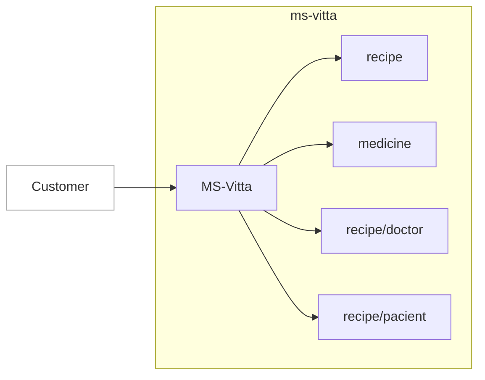

# MS-Vitta

### Resumo de funcionamento
MS-Vitta tem o papel de controle para as prescricões médicas alertando sobre os riscos da interação entre os remedios e consultar as prescições já realizadas.

### Topologia


### Estrutura de diretórios
```
    .
    ├── configs            # Dentro dessa pasta estão os arquivos contendo as constantes da aplicação
    ├── server             # Arquivos contendo as configurações gerais do servidor da aplicação
    ├── src                # lib, models, services, logs...
    └── test               # Testes unitários
```

### Chamadas exemplo

### **GET** /health
- Retorna o status do serviço.

>:white_check_mark: **_Retorno com sucesso_**

>**HTTP Status** `200`
```
{
    "/health": true
}
```

>:x: **_Retorno default_**

>**HTTP Status** `500`

>**Response**
```
{ "description": "Serviço indisponível" }
```

### **GET** /medicine/page/:id
- Retorna a listagem de medicamentos

>:white_check_mark: **_Retorno com sucesso_**

>**HTTP Status** `200`
```
{
   {
    "totalPages": 177,
    "page": "1",
    "data": [
			{
            "IdMedicamento": 33474,
            "Nome": "PRATURE",
            "Farmaco": null,
            "Farmacos": [
                "PANTOPRAZOL SODICO SESQUI-HIDRATADO"
            ],
            "Concentracao": "40",
            "Unidade": "MG",
            "TipoMedicamento": "SIMILAR",
            "FormaFarmaceutica": "COMPRIMIDO REVESTIDO DE LIBERACAO RETARDADA",
            "ViaAdministracao": "ORAL",
            "CodigoATC": "A02B2",
            "UsoInterno": true,
            "Antimicrobiano": false,
            "Bula": null,
            "Portaria344": "",
            "ControleEspecial": false,
            "TISS": "525917020050403",
            "MIP": false,
            "Label": "PRATURE 40MG - COMPRIMIDO REVESTIDO DE LIBERACAO RETARDADA",
            "Unificado": null
        }
		]
	 }
}
```

>:x: **_Pagina invalida_**

>**HTTP Status** `400`

>**Response**
```
{"message": "Limit of page is 177"}
```

>:x: **_Pagina invalida_**

>**HTTP Status** `401`

>**Response**
```
{"error": "Not authorized to access this resource"}
```


### **GET** /medicine/:id
- Retorna o medicamento

>:white_check_mark: **_Retorno com sucesso_**

>**HTTP Status** `200`
```

{
			"IdMedicamento": 33474,
			"Nome": "PRATURE",
			"Farmaco": null,
			"Farmacos": [
					"PANTOPRAZOL SODICO SESQUI-HIDRATADO"
			],
			"Concentracao": "40",
			"Unidade": "MG",
			"TipoMedicamento": "SIMILAR",
			"FormaFarmaceutica": "COMPRIMIDO REVESTIDO DE LIBERACAO RETARDADA",
			"ViaAdministracao": "ORAL",
			"CodigoATC": "A02B2",
			"UsoInterno": true,
			"Antimicrobiano": false,
			"Bula": null,
			"Portaria344": "",
			"ControleEspecial": false,
			"TISS": "525917020050403",
			"MIP": false,
			"Label": "PRATURE 40MG - COMPRIMIDO REVESTIDO DE LIBERACAO RETARDADA",
			"Unificado": null
}
```

>:x: **_Medicamento Não encontrado**

>**HTTP Status** `404`

>**Response**
```
{"message": "Medicine 1 is not valid"}
```

>:x: **_Pagina invalida_**

>**HTTP Status** `401`

>**Response**
```
{"error": "Not authorized to access this resource"}
```


### Instalação
**Caso esteja em ambiente Windows, você deverá utilizar o terminal do Ubuntu para Windows.**

Para executar a aplicação em ambiente local, basta executar os seguintes comandos no terminal: 
```bash
git clone https://gitlab.nexteldigital.com.br/NextelDigital/nextel-promotion .
nvm use
sudo npm install
npm run dev
```
A aplicação estará rodando em http://localhost:3000

### Testes
Com a aplicação instalada, para executar os testes unitários, utilize o comando `npm test` no terminal.
